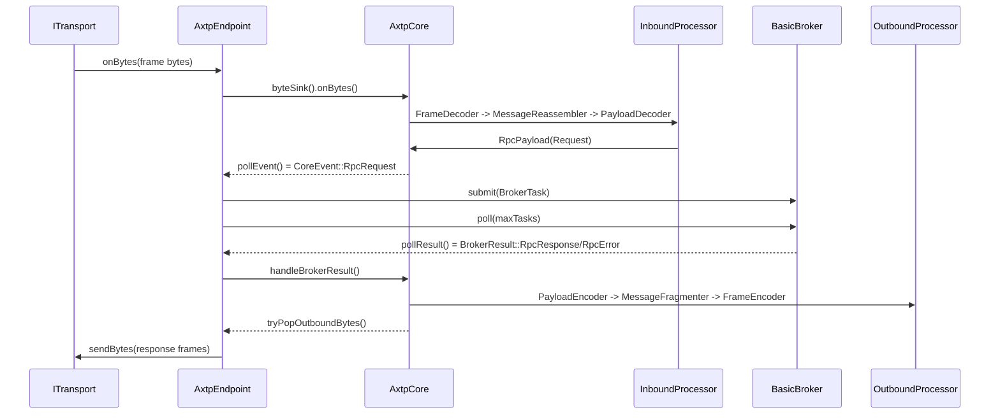

# AXTP C++ 执行流程

本文档描述当前 C++ runtime、SDK 和 CLI 的端到端执行流程。Core API 见 `docs/dev/AXTP_CORE_API_DESIGN.md`，runtime 架构和设计模式见 `docs/dev/AXTP_CPP_RUNTIME_PATTERNS.md`，命名规范见 `docs/dev/AXTP_CPP_STYLE.md`。

## 通用 Runtime 生命周期

普通应用推荐生命周期：

```text
construct BasicBroker<> broker
construct AxtpEndpoint endpoint(broker)
construct or receive an ITransport implementation

endpoint.attachTransport(transport)
transport.open()

while running:
  poll the concrete transport if it exposes ManualPoll
  endpoint.poll()

transport.close()
endpoint.detachTransport()
```

实际 `ITransport` 接口没有强制 `poll()`，因为不同 transport 可以用不同平台机制。当前 HID 和测试 transport 使用 ManualPoll；SDK/工具层负责识别 concrete transport 的轮询入口。

## FramedBinary Inbound 请求

FramedBinary 入口是字节流或二进制消息。transport 不解析 AXTP，只把 bytes 交给 endpoint 绑定的 sink。



关键点：

- `FrameDecoder` 可以接收 split bytes；重组在 core pipeline 内完成。
- `AxtpCore` 不执行 handler，只输出 `CoreEvent`。
- `BasicBroker<>` 不知道 frame/header/CRC。
- `AxtpEndpoint::poll()` 是事件和结果搬运点。

## WebSocketJsonRpc Text 流程

WebSocketJsonRpc 是正式 AXTP wire mode，输入是一条完整 UTF-8 text message：

```json
{"sid":"...","op":7,"d":{"id":1,"method":"audio.getAlgorithmConfig","params":{}}}
```

执行路径：

```text
WebSocket text message bytes
  -> ITransport::bind sink
  -> AxtpEndpoint::onTransportBytes()
  -> AxtpCore::byteSink()
  -> JsonRpcDecoder
  -> RpcPayload
  -> CoreEvent
  -> BasicBroker<>
  -> BrokerResult
  -> JsonRpcEncoder
  -> UTF-8 JSON response bytes
  -> ITransport::sendBytes()
```

规则：

- WebSocketJsonRpc 不走 AX Standard Frame、CRC、message fragmentation。
- `params/result/data` 作为 UTF-8 JSON bytes 存在 `RpcPayload.body` 中。
- method/event/error name 通过 generated registry lookup 解析。
- 若继续使用 `IByteSink::onBytes()`，每次调用必须是一条完整 text message。

Spec 对齐：

- `docs/specs/03-AXTP-Transport-Profiles.md` 定义 `AXTP-WS-JSON` 和 `AXTP-WS-CLOUD-REVERSE`，它们都是 WebSocket Unframed JSON profile。
- `docs/specs/05-AXTP-RPC-Session-Spec.md` 定义 `sid/op/d` envelope，以及 Hello、Identify、Identified、Request、RequestResponse、Event、Batch 语义。
- 当前没有独立 WebSocket JSON-RPC profile 文档；如果后续新增，应作为 runtime 的最具体依据。

Mosculer 只作为历史上下文，用来解释 OBS-style envelope 的来源；runtime 格式以 AXTP specs 为准。WebSocketJsonRpc 不是 AXDP/legacy adapter，也不承载 legacy command id、legacy status code、旧 checksum 或旧 header。需要兼容旧协议时，应做成独立可选 adapter，并依赖 cpp/core 的归一化 payload 接口。

## Client Dynamic Call 流程

SDK client 默认动态 RPC：

```text
AxtpClient::callJson("audio.getAlgorithmConfig", "{}")
  -> MethodRegistry::findMethodId()
  -> RpcPayload{op=Request, encoding=Json, body="{}"}
  -> AxtpEndpoint::sendRpcRequest()
  -> AxtpCore::expectRpcResponse()
  -> AxtpCore::sendRpcRequest()
  -> outbound bytes
  -> transport.sendBytes()
  -> poll loop until tryTakeRpcResponse(requestId)
```

如果 `AxtpClient` 注册了本地 mock handler，`callRaw()` 可以不经过 transport I/O 直接返回。否则 client 需要已绑定 transport 和 poll loop。

Typed calls follow the same path:

```text
typed request -> SchemaCodec -> callRaw -> response bytes -> SchemaCodec -> typed response
```

Typed API must not bypass dynamic/raw RPC.

## Server 流程

SDK server wraps endpoint + broker:

```text
AxtpServer::attachTransport()
  -> transport.open()
  -> endpoint.attachTransport()

AxtpServer::onJson(name, handler)
  -> BasicBroker::registerJsonMethod(name, handler)

AxtpServer::poll()
  -> endpoint.poll()
  -> broker handler dispatch
  -> core response encode
  -> transport.sendBytes()
```

`AxtpServer` is intentionally thin. Full multi-connection routing, session tables, subscription filters, and async I/O are future layers above endpoint/core/broker.

## HID Transport 流程

HID transport is the first real concrete transport and follows the transport-boundary rule:

```text
poll()
  -> backend read input report
  -> check reportId
  -> strip reportId slot
  -> sink.onBytes(report payload, including padding)

sendBytes(bytes)
  -> split by outputReportSize - 1
  -> write [reportId][chunk][zero padding]
```

HID transport does not strip inbound trailing zero padding because it cannot know AXTP payload length. FramedBinary decoder performs length-based parsing and resync.

## CLI Command 流程

Normal CLI command flow:

```text
argv
  -> parse global options and command
  -> load generated/default MethodRegistry
  -> optionally merge --registry-file
  -> construct AxtpClient
  -> attach mock or optional concrete transport
  -> execute SDK dynamic call
  -> format output as json/hex/file
```

`inspect` commands are the exception: they may directly parse AXTP frame bytes for diagnostics. Regular `call`, `ping`, `capability`, `event`, and future `stream` commands should stay at SDK level.

## Direct Core 流程

Advanced users can bypass endpoint and broker:

```cpp
axtp::AxtpCore core;
core.configure(profile);
core.byteSink().onBytes(data, size);

while (auto event = core.pollEvent()) {
    // Inspect or convert event yourself.
}

core.handleBrokerResult(result);

while (auto bytes = core.tryPopOutboundBytes()) {
    writer.writeBytes(bytes->data(), bytes->size());
}
```

Direct core usage is useful for fuzzing, protocol conformance tests, or embedding AXTP in an existing scheduler. Application code that wants normal request/response dispatch should use `AxtpEndpoint + BasicBroker<>`.

## Poll 顺序

Recommended tick order when using ManualPoll transports:

1. Poll transport/platform source to feed incoming bytes into endpoint.
2. Call `endpoint.poll(maxTasks)` to drain core events, run broker work, feed results back, and flush outbound bytes.
3. Repeat at the application scheduler rate.

Within `endpoint.poll()` the order is intentionally stable:

```text
drainCoreEvents()
broker.poll(maxTasks)
drainBrokerResults()
flushOutbound()
```

This keeps request handling deterministic and makes unit tests independent of threads.

## Error 与 Status 流程

- Wire/protocol errors should be represented as `CoreEventType::ProtocolError` or status/error payloads.
- Business errors should return `RpcResponseData` with a non-success `ErrorCode`; broker converts that into `BrokerResult::rpcError()`.
- Core decides how the selected wire mode encodes the error response.
- Transport read/write failures should not throw through core; they are platform diagnostics handled by the concrete transport or SDK/tool layer.
