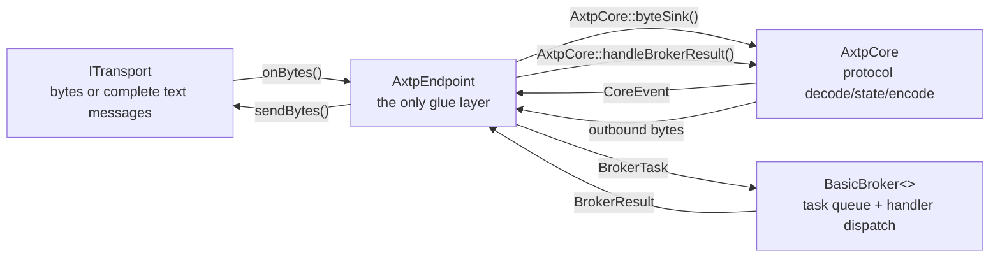
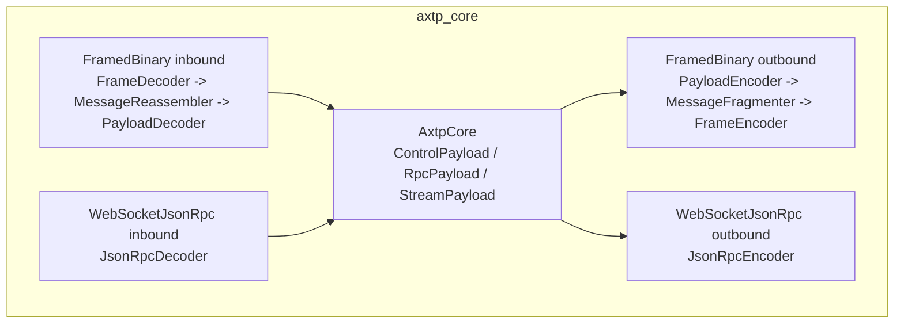

# AXTP C++ Runtime 架构与设计模式

本文档记录当前 C++ runtime 的代码设计模式。它描述“为什么这样分层”和“新增功能时应该放在哪里”，不替代 wire spec。
本文中的 C++ runtime 路径均相对于独立仓库 `axtp-cpp-runtime`。

核心结构固定为：

```text
ITransport <-> AxtpEndpoint -> AxtpCore -> BasicBroker<>
```

`AxtpEndpoint` 是唯一 glue layer。`AxtpCore` 只处理协议解析、协议状态和 outbound bytes；`BasicBroker<>` 只处理业务任务、handler dispatch 和结果队列；`ITransport` 只处理平台 I/O。

## Target 映射

| Target | 形态 | 职责 |
|---|---|---|
| `axtp_core` | `INTERFACE` | model、IO interfaces、transport profile、FramedBinary pipeline、WebSocketJsonRpc decoder/encoder、`AxtpCore`、generated lookup helpers |
| `axtp_broker` | `INTERFACE` | `BasicBroker<>`、`BrokerTask`、`BrokerResult`、dynamic method dispatch helpers |
| `axtp_runtime` | `INTERFACE` | core + broker + endpoint glue，供普通应用使用 |
| `axtp_json_rpc` | `INTERFACE` | WebSocket session helper adapter 和 JSON registry-file loader |
| `axtp_transport_hidapi` | `STATIC` optional | HID report-level transport，位于 `transports`，依赖 `thirdparty/hidapi` |
| `axtp_transport_tcp_boost` | `INTERFACE` optional | Boost.Asio TCP transport，位于 `transports` |
| `axtp_transport_websocket_boost` | `INTERFACE` optional | Boost.Beast WebSocket transport，位于 `transports` |

推荐 runtime include：

```cpp
#include <axtp.hpp>
```

Concrete transports 不包含在聚合头中。

## 开发文档地图

| 文档 | 作用 |
|---|---|
| `docs/dev/AXTP_CORE_API_DESIGN.md` | Core API contract、public header groups、target boundary |
| `docs/dev/AXTP_CPP_RUNTIME_PATTERNS.md` | Runtime 架构、设计模式、extension recipe、anti-pattern |
| `docs/dev/AXTP_CPP_EXECUTION_FLOW.md` | Runtime、SDK、CLI、transport 的端到端执行流程 |
| `docs/dev/AXTP_CPP_STYLE.md` | C++ 命名、文件布局、include、formatting、ownership 规则 |
| `docs/dev/AXTP_SDK_API_DESIGN.md` | SDK API 形态和 dynamic RPC 策略 |
| `docs/dev/AXTPCTL_COMMAND_DESIGN.md` | CLI 命令形态和 dispatch 策略 |

## Runtime 数据流



`AxtpCore` 不拥有也不 include concrete transport，不拥有 broker。`BasicBroker<>` 不回调 core。`AxtpEndpoint` 负责搬运 `CoreEvent`、轮询 broker、把 `BrokerResult` 送回 core，并把 outbound bytes flush 到 transport。

## Wire Path 分流



- `FramedBinary` 承载 AXTP Standard Frames。
- `WebSocketJsonRpc` 是正式 AXTP wire mode，使用完整 UTF-8 text message 和 `sid/op/d` envelope。
- JSON-RPC decoder/encoder 位于 core，因为 runtime 直接支持该 wire mode；因此 Boost.JSON 是允许的 `axtp_core` 依赖。
- `WebSocketJsonRpcAdapter` 只是可选 session/transport helper，不拥有 `AxtpCore` 或 `BasicBroker<>`。

## 模式地图

| 模式 | 代码位置 | 作用 |
|---|---|---|
| Endpoint glue | `runtime/axtp_endpoint.hpp` | 唯一连接 transport、core、broker 的对象 |
| Protocol-only core | `core/axtp_core.hpp` | 解码 payload、维护 session/pending calls、输出 `CoreEvent` 和 bytes |
| Task/result broker | `broker/basic_broker.hpp` | 接收 `BrokerTask`，分发 handler，输出 `BrokerResult` |
| Port adapter | `AxtpCore` 内部 sink/writer port | 把内部 processor 适配成队列输出，避免 core 暴露可变实现细节 |
| Pipeline processor | `core/inbound/*`、`core/outbound/*` | 把 wire mode 的解析和编码分成小组件 |
| Dynamic RPC first | `MethodRegistry` + broker dynamic handlers | 默认按 method id/name + body bytes 调用业务 |
| Optional platform adapter | `transports/*` | HID/TCP/WebSocket 作为可选 transport target，不污染 core |
| Generated facts boundary | `generated/*` | ID、registry、schema 是事实源产物；runtime 不手写业务常量 |

## Endpoint Glue 模式

`AxtpEndpoint` 持有一个 `AxtpCore`，引用一个外部拥有的 `BasicBroker<>`，并可绑定一个外部拥有的 `ITransport`。它负责四件事：

1. `attachTransport()`：读取 `TransportProfile`，配置 core wire mode，把 endpoint byte sink 绑定给 transport。
2. `poll()`：按固定顺序搬运 `CoreEvent -> BrokerTask -> BrokerResult -> Core`。
3. `sendRpcRequest()`：为客户端请求登记 pending call，调用 core 生成 outbound bytes。
4. `flushOutbound()`：把 core 生成的 bytes 写给 transport。

设计约束：

- 新的 glue 逻辑优先放在 endpoint，而不是让 core 直接知道 broker 或 transport。
- endpoint 不拥有 transport 生命周期；SDK 或应用层决定 transport 的构造、open、close。
- endpoint 不执行业务 handler；业务只在 broker 中运行。

## Protocol-Only Core 模式

`AxtpCore` 是高级用户可直接使用的协议状态机。它的稳定交互面是：

```cpp
core.configure(profile);
core.byteSink().onBytes(data, size);
auto event = core.pollEvent();
core.handleBrokerResult(result);
auto bytes = core.tryPopOutboundBytes();
core.expectRpcResponse(requestId);
auto response = core.tryTakeRpcResponse(requestId);
```

Core 可以做：

- FramedBinary frame/message/payload 解码和编码。
- WebSocketJsonRpc `sid/op/d` envelope 解码和编码。
- CONTROL session 状态处理。
- RPC pending response 管理。
- STREAM payload 事件输出。

Core 不可以做：

- 创建或持有 HID/TCP/WebSocket concrete transport。
- 调用业务 handler。
- 依赖 SDK、CLI、thread、socket、hidapi、Boost.Asio、Boost.Beast。
- 硬编码 legacy command 或 AXDP wire 格式。
- 使用 typed generated request/response struct 作为调度前提。

## Task/Result Broker 模式

`BasicBroker<>` 是 header-only、ManualPoll 的业务分发器。数据流是：

```text
CoreEvent -> BrokerTask -> BasicBroker::submit()
BasicBroker::poll()
BrokerResult -> AxtpCore::handleBrokerResult()
```

Broker 只看到归一化后的 `RpcPayload`、`StreamPayload` 和 `ControlPayload`，不解析 AXTP frame。RPC handler 默认是动态形态：

- `registerRawMethod(methodId, handler)`
- `registerJsonMethod(methodId/name, handler)`
- `registerTlvMethod(methodId/name, handler)`

Typed API 只能作为上层 wrapper：typed request -> codec -> raw/dynamic call -> codec -> typed response。

## Port Adapter 模式

`AxtpCore` 内部使用三个 port adapter：

- `ByteSinkPort`：给 inbound processor 输入 bytes。
- `PayloadSinkPort`：接收 decoded payload，转换为 core state 或 `CoreEvent`。
- `ByteWriterPort`：接收 outbound processor bytes，压入 core outbound queue。

这些 adapter 的价值是让 processor 继续保持窄接口，而 core 外部只看到队列式 API。新增 processor 时优先复用该模式，不要直接暴露 processor 指针。

## Pipeline Processor 模式

FramedBinary pipeline：

```text
FrameDecoder -> MessageReassembler -> PayloadDecoder -> Core
PayloadEncoder -> MessageFragmenter -> FrameEncoder -> bytes
```

WebSocketJsonRpc pipeline：

```text
complete UTF-8 text message -> JsonRpcDecoder -> Core
RpcPayload -> JsonRpcEncoder -> complete UTF-8 text message bytes
```

规则：

- Wire mode 由 `TransportProfile.wireMode` 决定。
- WebSocketJsonRpc 输入必须是一条完整 text message。
- FramedBinary 允许字节流分片，frame/message 重组由 core pipeline 完成。
- 新 wire mode 应先落成独立 decoder/encoder，再由 `InboundProcessor`/`OutboundProcessor` 选择。

## Transport Boundary 模式

`ITransport` 的职责只有：

```cpp
bind(IByteSink&);
open();
close();
sendBytes(data, size);
profile();
```

Transport 可以处理平台特有边界，例如 HID report id、report size、padding、socket read/write、WebSocket text/binary message 边界。Transport 不可以解析：

- AXTP Standard Frame
- Payload type
- MethodId/EventId
- JSON-RPC method name
- Legacy/AXDP command

如果 transport 需要额外平台库，应放在 `transports` 或更上层 target。`core/include` 不能泄漏平台 include。

## Dynamic RPC 模式

运行时默认路径是 dynamic RPC：

```text
method name/id + RpcEncoding + body bytes
```

推荐顺序：

1. CLI 和 SDK 默认使用 `callJson()` 或 `callRaw()`。
2. Broker 默认注册 `registerJsonMethod()`、`registerTlvMethod()`、`registerRawMethod()`。
3. Typed generated API 只做可选便利层。

这样新增业务 method 时，只要 registry 能解析 name/id，就可以先跑通动态调用；schema-aware codec 可以后续增强。

## 扩展 Recipe

### 新增 Transport

1. 在 `transports/include/<name>/` 增加 public header。
2. 实现 `ITransport`，只处理平台 I/O。
3. `profile()` 填写 `TransportKind`、`AxtpWireMode`、message/text/binary 能力和 `preferredFrameSize`。
4. 在 optional CMake target 中链接平台依赖。
5. 使用 `MockTransport` 或 backend seam 做 report/message/byte slicing 测试。

### 新增 Business Method

1. 修改 `registry/domains/<domain>/domain.yaml` 或对应 registry 源 YAML。
2. 运行 generator，刷新 generated docs/headers/tooling。
3. SDK/CLI 可先通过 dynamic JSON/TLV/Raw 调用。
4. 需要 typed API 时再补 generator 或 facade。

### 新增 Broker Handler

1. 优先用 `registerJsonMethod(name, handler)` 或 `registerRawMethod(id, handler)`。
2. Handler 只读 `RpcRequestView`，返回 `RpcResponseData`。
3. 不在 handler 中写 transport；事件和 stream 结果通过 broker/core 结果流返回。

### 新增 CLI Command

1. 命令解析留在 `tools/axtpctl/src/main.cpp` 或后续拆分模块。
2. 业务调用走 SDK；只有 `inspect` 类命令可以直接读 core model/decoder。
3. 输出格式固定为 JSON、hex 或 file，不混合 debug 文本和机器输出。

## 测试地图

| Test | 覆盖范围 |
|---|---|
| `phase1_model_io_test` | model 和 IO primitives |
| `phase2_inbound_test` | FramedBinary 与 WebSocketJsonRpc inbound decode |
| `phase3_outbound_test` | FramedBinary 与 WebSocketJsonRpc outbound encode |
| `phase4_core_test` | standalone core events、control handling、broker-result handling |
| `phase5_transport_test` | `AxtpEndpoint` + `MockTransport` |
| `phase6_real_transport_test` | optional TCP 和 WebSocketJsonRpc transport flows |
| `phase7_broker_test` | `BasicBroker<>` dynamic Raw/JSON/TLV dispatch |
| `phase8_api_surface_test` | `<axtp.hpp>`、packet/text IO、dynamic registry |
| `phase9_hid_transport_test` | optional HID report slicing、report-id filtering、ManualPoll callbacks |

## Anti-Pattern

- `AxtpCore` 直接 `attachTransport()` 或 `attachBroker()`。
- `BasicBroker<>` 保存 `AxtpCore*` 并回调 core。
- concrete transport include 出现在 `core/include`。
- transport 根据 `MethodId` 或 payload type 分流。
- CLI 为普通 `call` 命令手写 frame。
- core 为某个业务 schema 引入 `MethodTraits` 或 `SchemaCodec`。
- 新增旧 include 路径转发头来隐藏迁移成本。
