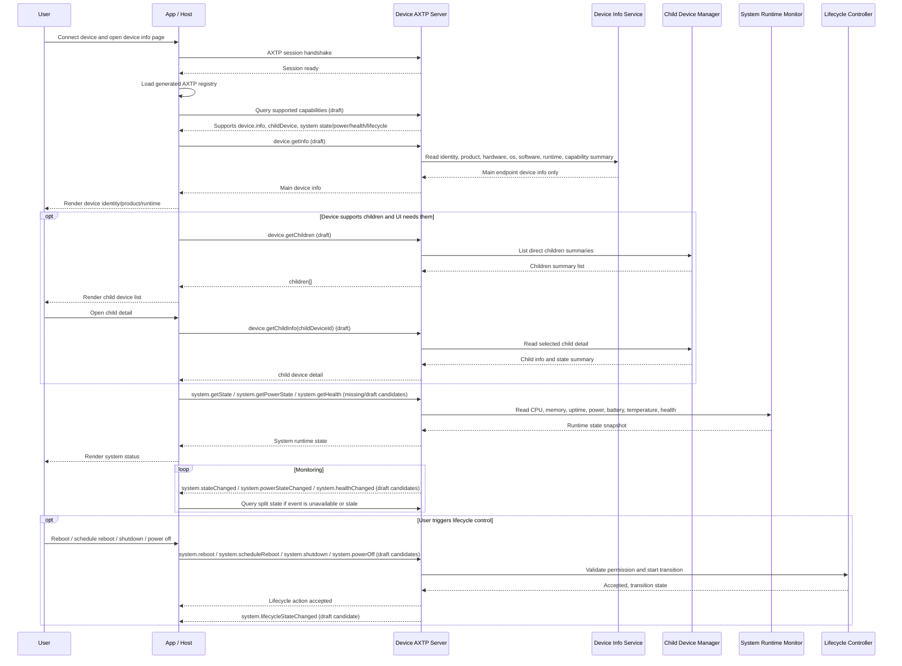

# Device Information And System Runtime State Protocol Interaction Flow

> Status: flow design
> Scope: Generic device identity, device information, child-device discovery, and system runtime state monitoring/control
> Source inputs: `docs/business/device-system-info.md`, pasted reference text 1 for generic `device.getInfo` schema, pasted reference text 2 for child-device split APIs, `docs/protocol/device/**`, `docs/protocol/system/**`, `docs/protocol/capability/capability.registry.md`, `docs/generated/protocol.md`
> Protocol lifecycle: Stage 10 `plan-protocol-flow`

本文根据“设备信息管理需求大纲”和两段参考设计，梳理设备连接后读取基础信息、读取主设备和级联设备、读取/监听系统运行时状态，以及执行关机、重启、断电类控制的 AXTP 交互流程。

本文不是最终协议事实源；已采纳事实以 `registry/**/*.yaml`、`registry/domains/**/*.yaml`、`protocol/axtp.protocol.yaml` 和 `docs/generated/**` 为准。当前 generated 协议只包含 AXTP Core、connection profiles、RPC/STREAM 基础事实、错误码和 `audio.algorithm` 业务方法；本文涉及的 `device.*` / `system.*` / `capability.*` 仍是草案或缺口。

## 1. Story Summary

| Item | Content |
|---|---|
| User goal | 用户或上位机连接设备后，快速获取当前 AXTP endpoint 代表的主设备身份和产品信息，按需发现级联/子设备，并持续查看 CPU、温度、电源等系统运行时状态。 |
| Trigger | App / PC host / cloud console 建立 AXTP session 后打开设备信息或系统状态页面。 |
| Success result | UI 可以区分“这是谁”与“现在状态怎样”；主设备信息轻量稳定；子设备和拓扑按需加载；运行时状态可轮询或事件同步；关机/重启等控制有明确权限和状态反馈。 |
| Primary actors | User, App / PC host / cloud server, Device AXTP server, device info service, child-device manager, system runtime monitor, lifecycle controller |
| Product scope | 通用设备；覆盖 Windows Launcher、嵌入式设备、投屏接收端、数字标牌、Rooms 设备、主从/级联设备。 |

## 2. Source Observations

### 2.1 UI / Prototype

| Screen or control | Observed behavior | Protocol relevance |
|---|---|---|
| Device connection result | 连接完成后第一屏需要展示设备 ID、SN、产品、硬件、软件和 AXTP runtime。 | 需要 `device.info`，但当前草案还未采用参考文本中的分组 schema。 |
| Device identity card | 展示 `deviceId`、`serialNumber`、产品型号、展示名。 | `device.getInfo` 应回答“我是谁”，不要把软件名写进 `product.model`。 |
| Product / hardware / OS / software section | 同一接口要适配 Windows 盒子、嵌入式设备、Android 标牌、RTOS dongle 等多种设备。 | `device.info` schema 需要拆为 identity/product/hardware/os/software/runtime/capability 摘要，避免 `model` 字段过载。 |
| AXTP runtime section | 展示承载 AXTP 的 runtime、runtime 版本、host app。 | `runtime` 不等同于硬件型号；例如 NearHub Launcher 应在 `software.components` 或 `runtime.hostAppId`。 |
| Capability summary | 页面展示建模摘要，完整能力走单独能力查询。 | 推荐的 `device.getInfo` 保留轻量 capability 摘要，用于表达 profile、domains 和 domain.feature 建模；supported methods/events 依赖 `capability.registry` 草案或产品静态门禁。 |
| Child devices tab | 有主从或级联设备时，需要查看一级子设备、按需查看子设备详情、必要时查看完整树。 | 不应让 `device.getInfo` 默认返回所有子设备；需要 `device.childDevice` / topology 相关方法。 |
| System status panel | 展示 CPU、内存、温度、电源/电池/供电、健康状态、在线状态。 | 已确认拆为 `system.state`、`system.power`、`system.health` 三个控制范围；旧 `device.power` / `device.state` 草案已迁移。 |
| Lifecycle controls | 用户触发关机、立即重启、计划重启、断开设备电源。 | 立即重启、计划重启和关机归 `system.lifecycle`；断开设备电源为软件发起的 `powerOff`，归 `system.power` 动作候选，不是外部 PDU/继电器断电。 |
| State change monitor | 状态变化后 UI 自动刷新。 | 需要 system runtime state changed event；若事件未采纳，首版可轮询。 |
| UI prototype image | `[REVIEW-ASK]` 本轮未提供 UI 图；字段显示顺序、危险操作确认弹窗和权限提示需产品/UI 确认。 | 不新增协议，只影响 App 呈现。 |

### 2.2 Requirement Notes

- `device.getInfo` 应轻量、稳定、快速，默认只返回当前 AXTP endpoint 代表的主设备信息。
- `device.getInfo` 不应默认返回所有级联设备。级联设备数量、状态、权限、缓存策略与主设备信息不同，应拆到 children/topology 接口。
- `device.getInfo` 推荐分组：identity / product / hardware / os / software / runtime / capability。
- `product.model` 表示硬件或整机型号，不应填 `NearHub Launcher` 这类软件名。
- `software.components` 表示 Launcher、Signage、Cast Receiver 等软件组件；`runtime` 表示当前 AXTP runtime 和 host app。
- 运行时状态建议收敛到 `system`，并拆成 `system.state`、`system.power`、`system.health`：`device` 专注身份、产品和拓扑。
- 关机、立即重启、计划重启属于 system lifecycle control；断开设备电源是软件关机方式实现的 `powerOff`，归 system power control；恢复默认/恢复出厂属于 reset/initialization 边界，不能混在 `device.info`。

## 3. Assumptions And Non-Goals

| Type | Item | Status |
|---|---|---|
| Assumption | 一个 AXTP endpoint 默认代表一个主设备；子设备是该主设备代理、管理或挂载的对象。 | `[REVIEW-DRAFT]` |
| Assumption | `device.getInfo` 默认不返回 children；如支持 `includeChildren`，默认值必须是 `false`，且只返回 summary。 | `[REVIEW-DRAFT]` |
| Assumption | 推荐的 `device.getInfo` 保留 capability 建模摘要；完整 methods/events/permissions 查询由 `capability.registry` 或后续能力发现协议承接。 | `[REVIEW-DRAFT]` |
| Assumption | `device.info` 与 `device.identity` 合并为一个 `device.info` 能力，统一承载只读设备信息和受权限控制的显示名/资产标识写入。 | `[REVIEW-OK]` |
| Assumption | system 运行时状态拆成 `system.state`、`system.power`、`system.health` 三个 capability，分别表达通用运行指标、电源控制/状态、健康状态。 | `[REVIEW-OK]` |
| Assumption | “断开设备的电源”定义为 `powerOff`：由软件发起的关机下电流程，不是 suspend，也不是外部 PDU/继电器硬断电。 | `[REVIEW-OK]` |
| Assumption | 计划重启是 lifecycle 动作，使用 `system.scheduleReboot`；不放入 `system.power` 的电源计划。 | `[REVIEW-OK]` |
| Assumption | 旧 `device.power` 线索仅作为 legacy mapping 背景，电源状态和控制进入 `system.power`。 | `[REVIEW-DRAFT]` |
| Non-goal | 不在本阶段修改 `docs/protocol/**`、registry YAML、Protocol IR 或 generated 文件。 | `[REVIEW-OK]` |
| Non-goal | 不设计 network、storage、audio、firmware 等非 device/system 业务细节。 | `[REVIEW-OK]` |
| Non-goal | 不把调试方便的一次性大 payload 作为默认稳定接口。 | `[REVIEW-OK]` |

## 4. Protocol Coverage

| Need | Coverage state | AXTP protocol | Evidence | Next action |
|---|---|---|---|---|
| 建立设备管理会话 | Adopted/generated core | AXTP session, RPC, supported connection profiles | `docs/generated/protocol.md`, `protocol/axtp.protocol.yaml` | 可按 AXTP Core 实现连接和 RPC envelope。 |
| 加载当前正式方法表 | Adopted/generated core / local behavior | Generated registry | `docs/generated/protocol.md` | App/Host 使用当前 generated registry 做正式方法门禁。 |
| 运行时能力发现 | Drafted only | `capability.registry` | `docs/protocol/capability/capability.registry.md` | 转 Stage 20 明确 supported methods/events/capabilities 查询。 |
| 获取当前主设备信息 | Drafted only / schema gap | `device.info`; candidate `device.getInfo` | `docs/protocol/device/device.info.md`, pasted reference text 1 | 转 Stage 20 重写 `device.info` 为 identity/product/hardware/os/software/runtime/capability schema，并对齐 `device.getInfo` 命名。 |
| 可写设备显示名或资产标识 | Drafted only / confirmed merge | `device.info`; merged identity fields | `docs/protocol/device/device.info.md` | 转 Stage 20 在 `device.info` 中确认可写字段、权限和 changed event。 |
| 查询一级子设备摘要 | Drafted only / method gap | `device.childDevice`; candidate `device.getChildren` | `docs/protocol/device/device.childDevice.md`, pasted reference text 2 | 转 Stage 20 补 children summary schema，避免默认塞进 `device.getInfo`。 |
| 查询指定子设备详情 | Drafted only / method gap | `device.childDevice`; candidate `device.getChildInfo` | `docs/protocol/device/device.childDevice.md`, pasted reference text 2 | 转 Stage 20 补 child detail schema 和权限。 |
| 查询完整设备拓扑 | Missing / optional draft extension | Candidate `device.getTopology` | pasted reference text 2 | P1/P2 转 Stage 20；不作为 P0 代替 `getChildren`。 |
| 子设备状态变化通知 | Drafted only / naming gap | `device.childDeviceStateChanged` candidate | `docs/legacy-migration/classification/device.md`, `docs/protocol/device/device.childDevice.md` | 转 Stage 20 明确 child attached/detached/online/health event。 |
| 获取 CPU、内存、在线、uptime 等通用运行状态 | Missing / confirmed system split | Proposed `system.state`; migrated from old `device.state` direction | user confirmation | 转 Stage 20 新增 `system.state`，承载通用 runtime state，不承载 power/health 细节。 |
| 获取电源、电池、供电状态和执行 power off | Missing / confirmed system split | Proposed `system.power`; migrated from old `device.power` direction | user confirmation | 转 Stage 20 新增 `system.power`，承载 power state、power schedule、software `powerOff`。 |
| 获取温度、健康状态、告警摘要 | Missing / confirmed system split | Proposed `system.health` | user confirmation | 转 Stage 20 新增 `system.health`，承载 health、temperature、warnings、degraded/fault 状态。 |
| 监听运行时状态变化 | Missing / domain conflict | Proposed `system.stateChanged`, `system.powerStateChanged`, `system.healthChanged` | user confirmation, `docs/protocol/system/system.lifecycle.md` | 转 Stage 20 设计轮询和事件策略、字段变化粒度和节流。 |
| 关机、立即重启和计划重启控制 | Drafted only / method gap | `system.lifecycle`; candidates `system.reboot`, `system.scheduleReboot`, `system.shutdown` | `docs/protocol/system/system.lifecycle.md`, `docs/legacy-migration/classification/system.md` | 转 Stage 20 补 lifecycle action methods、危险操作确认语义、状态事件和错误。 |
| 断开设备电源 | Missing / confirmed power action | `system.power`; candidate `system.powerOff` | user confirmation | 转 Stage 20 定义软件发起的 power off 行为；不是 suspend，也不是外部 PDU/继电器硬断电。 |
| 恢复默认/恢复出厂 | Drafted only / semantic split | `system.reset` / `system.initialization` | `docs/protocol/system/system.reset.md`, `docs/protocol/system/system.initialization.md` | 不混入本 flow P0；后续若页面包含 reset，转 Stage 20 明确 reset scope。 |
| 系统时间 | Drafted only | `system.time` | `docs/protocol/system/system.time.md` | 本 flow 仅作为 system 示例，不展开；时间配置另走专门 flow/draft。 |

## 5. End-To-End Sequence



## 6. Interaction Steps

| Step | Actor | User or system action | Protocol call/event | Request / event payload notes | Response / state result | Error or fallback |
|---:|---|---|---|---|---|---|
| 1 | App / Device | 建立 AXTP session。 | Generated core session/RPC | 使用产品选定 transport；连接完成后 App 加载 generated registry。 | RPC 可用。 | 握手失败显示连接错误。 |
| 2 | App | 检查正式 generated 方法。 | Local generated registry lookup | 当前 generated 未包含 `device.*` / `system.*` 业务方法。 | App 知道这些方法仍是草案依赖。 | 纯 AXTP 实现需等待 Stage 20/30/50。 |
| 3 | App / Device | 查询运行时能力。 | Draft `capability.registry` or product static gate | 查询 supported domains/methods/events；能力摘要不替代完整查询。 | App 确认是否支持 device info、children、system state、lifecycle。 | 能力查询未采纳前，用固件版本和产品 profile 做显式门禁。 |
| 4 | App / Device | 读取主设备信息。 | Draft `device.getInfo` candidate | 默认不带 children；capability 只放建模摘要。 | 返回 identity/product/hardware/os/software/runtime/capability summary。 | 读取失败时页面显示无法识别设备；不要用 `product.model` 填软件名。 |
| 5 | App | 渲染设备信息。 | Non-protocol | UI 区分 SN、model、displayName、OS、software component、AXTP runtime。 | 用户看到“这是谁”。 | 本地展示策略，不进入协议。 |
| 6 | App / Device | 查询子设备摘要。 | Draft `device.getChildren` candidate | `includeInfo=summary`，`includeCapabilities=false`，默认只查一级。 | 返回 children[] 摘要、关系、路径、online、connection。 | 不支持子设备时隐藏 tab；子设备多时分页或过滤。 |
| 7 | App / Device | 查询子设备详情。 | Draft `device.getChildInfo` candidate | `deviceId` / `childDeviceId`；详情按需拉取。 | 返回单个子设备详情、software、capability summary、connection、state。 | `NOT_FOUND` 时刷新 children；权限不足提示。 |
| 8 | App / Device | 查询完整拓扑。 | Optional draft `device.getTopology` candidate | 仅拓扑管理页使用，可带 `maxDepth`。 | 返回树状 root/children。 | P0 不依赖；设备不支持时回退 children。 |
| 9 | App / Device | 查询通用系统运行状态。 | Missing candidate `system.getState` | 字段候选：cpu、memory、uptime、load、online、process/runtime summary。 | UI 展示设备是否运行正常和资源占用。 | 旧 `device.state` 方向已迁移到 `system.state`。 |
| 10 | App / Device | 查询电源状态和供电控制范围。 | Missing candidate `system.getPowerState` | 字段候选：powerSource、battery、charging、powerMode、powerSchedule、powerOffSupported。 | UI 展示供电/电池/电源计划。 | 旧 `device.power` 方向已迁移到 `system.power`。 |
| 11 | App / Device | 查询健康状态。 | Missing candidate `system.getHealth` | 字段候选：health、temperature、warnings、faults、degradedReason。 | UI 展示健康、温度和告警摘要。 | 温度和健康不混进 device identity；高频遥测需节流。 |
| 12 | Device / App | 状态变化同步。 | Missing candidates `system.stateChanged`, `system.powerStateChanged`, `system.healthChanged`; optional polling | 事件应可按字段变化节流；高频指标不应无节制上报。 | UI 自动刷新。 | 首版可轮询；事件丢失时以 split get 方法校准。 |
| 13 | User / App / Device | 执行立即重启。 | Draft `system.reboot` candidate | 需要 reason、delay、force、confirmation token 等待确认字段。 | 设备接受并进入 rebooting。 | `PERMISSION_DENIED`、`BUSY`、`INVALID_STATE`、`REBOOT_REQUIRED` 等错误可诊断。 |
| 14 | User / App / Device | 创建或更新计划重启。 | Draft `system.scheduleReboot` candidate | 需要 schedule、timezone、reason、confirmation token；可表达一次性或周期性计划。 | 设备保存计划并返回 scheduleId / nextRunAt。 | 时间无效返回 `INVALID_ARGUMENT` 或 `OUT_OF_RANGE`；权限不足返回 typed error。 |
| 15 | User / App / Device | 执行关机。 | Draft `system.shutdown` candidate | 软件发起的 graceful shutdown，不等同于 power off。 | 设备进入 shutting_down，连接可能断开。 | 权限不足或 busy 时返回 typed error。 |
| 16 | User / App / Device | 执行断开设备电源。 | Draft `system.powerOff` candidate under `system.power` | 已确认语义：通过软件关机方式实现的 power off；不是 suspend，也不是外部 PDU/继电器断电。 | 设备进入 powering_off / powered_off，连接断开。 | 不支持软件 power off 时返回 `NOT_SUPPORTED`；不走外部硬件协议。 |
| 17 | User / App / Device | 监听 lifecycle / power 状态。 | Draft `system.lifecycleStateChanged` and `system.powerStateChanged` candidates | 上报 reboot_scheduled、rebooting、shutting_down、powering_off、powered_off、ready 等状态。 | UI 显示过渡状态并等待重连。 | 断开后 App 进入重连流程。 |
| 18 | App / Device | 设备重连后刷新状态。 | Draft `device.getInfo`, `system.getState`, `system.getPowerState`, `system.getHealth` | 重新读取主设备和 split system runtime。 | 确认设备已恢复 ready。 | 超时提示人工检查。 |

## 7. Protocol Details

### 7.1 Adopted / Generated Protocols

| Method/Event/Profile | Purpose in this flow | Source |
|---|---|---|
| AXTP session / RPC envelope | 建立连接、承载请求响应和事件。 | `docs/generated/protocol.md`, `protocol/axtp.protocol.yaml` |
| Supported connection profiles | 支持 USB HID、TCP 和 WebSocket JSON 等接入方式。 | `docs/generated/protocol.md` |
| Core RPC errors | unsupported、invalid argument、permission denied、busy 等错误基础。 | `docs/generated/protocol.md`, `registry/error/error_code.yaml` |
| Generated method registry | App/Host 用于判断当前产品包中哪些方法已正式采纳。 | `docs/generated/protocol.md` |

当前 generated 协议没有 adopted `device.*`、`system.*` 或 `capability.*` 业务方法。下面的方法名都是 flow 级候选或草案依赖，不是实现合同。

### 7.2 Draft Or Missing Protocol Gaps

| Gap | Candidate domain.feature | Candidate method/event/schema | Routed skill | Review question |
|---|---|---|---|---|
| `device.info` 需要从配置型草案改成轻量主设备信息查询 | `device.info` | `device.getInfo`, `DeviceInfo(identity/product/hardware/os/software/runtime/capability)` | `draft-business-protocol` | `[REVIEW-OK]` `device.info` 合并 `device.identity`，并使用信息型 `device.getInfo` 方向起草。 |
| 可写显示名/资产标识归属 | `device.info` | displayName / assetName set method and changed event | `draft-business-protocol` | `[REVIEW-OK]` 不保留独立 `device.identity`；可写 identity 字段进入 `device.info`，但 `deviceId` / SN 默认只读。 |
| `device.getInfo` 多设备通用 schema 未固化 | `device.info` | productType enum, OS enum, software component roles, runtime fields | `draft-business-protocol` | `[REVIEW-ASK]` productType 枚举首批有哪些值？ |
| 子设备不应默认塞进主设备信息 | `device.childDevice` | `device.getChildren`, `device.getChildInfo`, optional `device.getTopology` | `draft-business-protocol` | `[REVIEW-ASK]` P0 是否只支持一级 children？最大深度和分页策略？ |
| 子设备事件命名和 payload 未固化 | `device.childDevice` | `device.childDeviceStateChanged` / `device.childrenChanged` | `draft-business-protocol` | `[REVIEW-ASK]` 事件是上报在线/离线，还是完整拓扑变化？ |
| system 运行时状态需要拆分 | `system.state`, `system.power`, `system.health` | `system.getState`, `system.getPowerState`, `system.getHealth` and changed events | `draft-business-protocol` | `[REVIEW-OK]` 三个 capability 分别表达通用运行指标、电源控制/状态、健康/温度/告警。 |
| power 当前在 device draft，但已确认归 system | `system.power` | `system.getPowerState`, `system.powerStateChanged`, `system.powerOff`, power schedule methods | `draft-business-protocol` | `[REVIEW-OK]` 迁移或废弃 `device.power` 草案，电源状态和 power off 进入 `system.power`。 |
| CPU/内存等通用运行时状态没有 system 草案 | `system.state` | `SystemRuntimeState`, `system.getState`, `system.stateChanged` | `draft-business-protocol` | `[REVIEW-ASK]` 哪些通用运行指标是 P0，哪些是诊断/telemetry 扩展？ |
| 温度、健康和告警状态没有 system 草案 | `system.health` | `system.getHealth`, `system.healthChanged` | `draft-business-protocol` | `[REVIEW-ASK]` 温度是否属于 health P0？告警和故障枚举如何定义？ |
| 关机/立即重启/计划重启控制缺动作型方法 | `system.lifecycle` | `system.reboot`, `system.scheduleReboot`, `system.shutdown`, lifecycle event | `draft-business-protocol` | `[REVIEW-ASK]` `scheduleReboot` 的一次性/周期性计划、取消和覆盖策略如何定义？ |
| 断开设备电源需要软件 power off 方法 | `system.power` | `system.powerOff`, `system.powerStateChanged` | `draft-business-protocol` | `[REVIEW-OK]` power off 是通过软件关机方式实现，不是 suspend 或外部 PDU/继电器断电。 |
| 能力发现缺正式 runtime query | `capability.registry` | supported methods/events/capabilities query | `draft-business-protocol` | `[REVIEW-ASK]` 是否需要动态能力查询，还是 generated registry + product profile 足够？ |

### 7.3 Recommended Payload Boundaries

`device.getInfo` should answer "who am I":

```json
{
  "identity": {
    "deviceId": "dev_001",
    "serialNumber": "NH-2026-000001",
    "vendorId": "nearhub",
    "productId": "nh-win-box-a1"
  },
  "product": {
    "brand": "NearHub",
    "productType": "windowsDevice",
    "model": "NH-WIN-BOX-A1",
    "displayName": "NearHub Display Controller"
  },
  "hardware": {
    "revision": "A1",
    "cpuArch": "x86_64",
    "memoryBytes": 8589934592
  },
  "os": {
    "type": "windows",
    "name": "Windows 11 IoT Enterprise",
    "version": "10.0.22631",
    "arch": "x86_64"
  },
  "software": {
    "components": [
      {
        "id": "launcher",
        "name": "NearHub Launcher",
        "version": "1.2.3",
        "role": "axtpHost"
      }
    ]
  },
  "runtime": {
    "axtpRuntime": "axtp-ts-runtime",
    "axtpRuntimeVersion": "0.1.0",
    "hostAppId": "launcher"
  },
  "capability": {
    "profile": "windows-managed-device",
    "domains": ["device", "system"],
    "features": [
      "device.info",
      "device.childDevice",
      "system.state",
      "system.power",
      "system.health",
      "system.lifecycle"
    ]
  }
}
```

Rules:

- `product.model` is a hardware or whole-product model; do not put `NearHub Launcher` there.
- `software.components[]` carries Launcher, Signage, Cast Receiver and similar software facts.
- `runtime` carries the AXTP runtime and host app facts.
- `capability` is a modeling summary only; complete supported methods, events, permissions, and dynamic availability belong to a dedicated capability query.
- `device.getInfo` default payload excludes children.

`device.getChildren` should answer "who is below me":

```json
{
  "children": [
    {
      "deviceId": "dev_camera_001",
      "parentDeviceId": "dev_launcher_001",
      "relation": "attached",
      "path": "dev_launcher_001/dev_camera_001",
      "online": true,
      "product": {
        "productType": "cameraDevice",
        "model": "CAM-A1",
        "displayName": "Front Camera"
      },
      "connection": {
        "type": "usb",
        "port": "usb-1"
      }
    }
  ]
}
```

`system.getState` should answer general runtime status:

```json
{
  "uptimeSeconds": 3600,
  "online": true,
  "cpu": {
    "usagePercent": 42.5
  },
  "memory": {
    "usedBytes": 2147483648,
    "totalBytes": 8589934592
  }
}
```

`system.getPowerState` should answer power and software power-off state:

```json
{
  "source": "ac",
  "batteryPercent": null,
  "charging": false,
  "powerMode": "normal",
  "powerOffSupported": true,
  "state": "running"
}
```

`system.getHealth` should answer health, temperature, warnings, and fault summary:

```json
{
  "health": "ok",
  "temperature": {
    "celsius": 48.2
  },
  "warnings": [],
  "faults": []
}
```

These system shapes are candidates only. They record the confirmed direction that runtime state is split into `system.state`, `system.power`, and `system.health`, with power off represented as software-initiated `system.powerOff`.

## 8. Test Fixtures

| Fixture | Expected result |
|---|---|
| `device-info-main-only` | `device.getInfo` returns the current endpoint main device and does not include children by default. |
| `device-info-generic-windows` | Windows Launcher device reports product/hardware/os/software/runtime without putting Launcher in `product.model`. |
| `device-info-generic-embedded` | Embedded or Android device uses the same schema with unavailable fields omitted. |
| `device-capability-summary` | `device.getInfo` carries a lightweight capability modeling summary; full methods/events require a dedicated capability query. |
| `device-children-list` | Device with children returns one-level summaries through `device.getChildren`. |
| `device-child-detail` | App fetches one child detail through `device.getChildInfo`; missing child returns `NOT_FOUND`. |
| `device-topology-optional` | Topology management page uses `device.getTopology` only if capability says supported. |
| `system-state-read` | App reads CPU/memory/uptime/online through `system.state`. |
| `system-power-read` | App reads power source, battery, charging, power mode and power-off support through `system.power`. |
| `system-health-read` | App reads health, temperature, warnings and fault summary through `system.health`. |
| `system-split-state-changed` | State, power and health changes are reflected through split events or polling fallback. |
| `system-reboot-flow` | Reboot action requires permission and returns lifecycle transition; App waits for disconnect/reconnect. |
| `system-schedule-reboot-flow` | Schedule reboot action stores a future or recurring reboot plan and reports the next run time. |
| `system-shutdown-flow` | Shutdown action requires permission and returns lifecycle transition. |
| `system-poweroff-flow` | Power off is software-initiated shutdown/power-off, not suspend and not external PDU/relay hard cut. |
| `unsupported-draft-method` | Before adoption/generated refresh, App does not call draft-only methods as stable contracts. |

## 9. Acceptance Gates

- `device.getInfo` is lightweight and default-main-device-only.
- `device.info` and `device.identity` are merged; device info schema separates identity/product/hardware/os/software/runtime/capability summary.
- Child devices and topology are queried through separate methods and have capability gates.
- Runtime state is not mixed into device identity/product information.
- Runtime state is split into `system.state`, `system.power`, and `system.health` before adoption.
- `system.powerOff` is software-initiated power off; it is not suspend or external PDU/relay hard power cut.
- Lifecycle and power controls have explicit permissions, confirmation strategy, schedule semantics, transition state and reconnect behavior.
- All draft-only and missing gaps have Stage 20 follow-up before registry/YAML/generated work.

## 10. Open Questions

- `[REVIEW-ASK]` `device.getInfo` 是否允许 `includeChildren=true`？如果允许，是否只返回 summary 且默认 false？
- `[REVIEW-ASK]` 子设备 ID 的稳定性规则是什么？`deviceId`、`localId`、`serialNumber` 和 topology `path` 如何组合？
- `[REVIEW-ASK]` `device.getTopology` 是否进入 P1/P2，还是本轮只采纳 `getChildren` / `getChildInfo`？
- `[REVIEW-ASK]` `system.state` 首批字段有哪些？CPU、内存、在线、uptime、load 是否都是 P0？
- `[REVIEW-ASK]` `system.power` 首批字段有哪些？电源计划是否和 power state 一起采纳？
- `[REVIEW-ASK]` `system.health` 首批字段有哪些？温度、告警、故障码和 degraded reason 如何分层？
- `[REVIEW-ASK]` legacy 中原归 `device.power` 的字段是否全部迁移到 `system.power`，还是有部分属于 telemetry/sensor？
- `[REVIEW-ASK]` `system.scheduleReboot` 是否支持周期性计划、覆盖已有计划、取消计划和查询计划？
- `[REVIEW-ASK]` `system.shutdown` 与 `system.powerOff` 在状态机和事件上如何区分？
