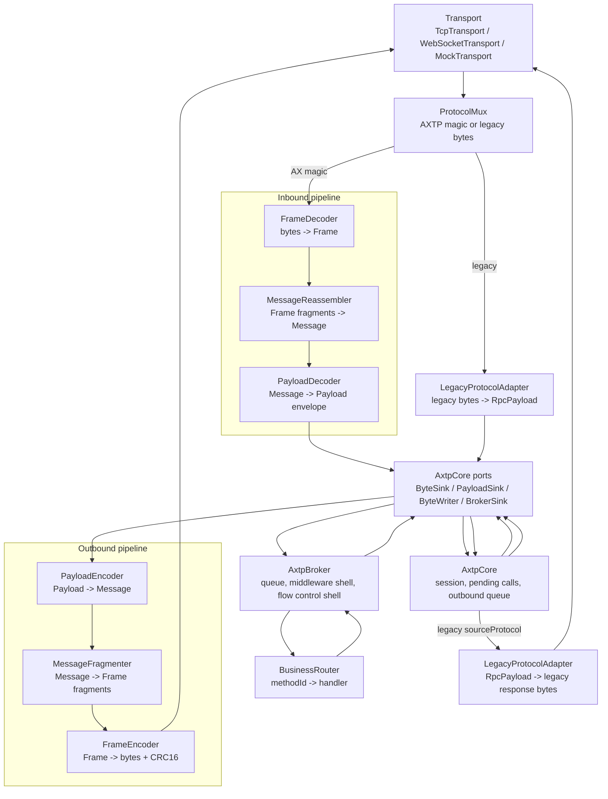
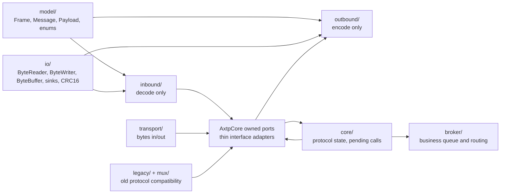

# AXTP C++ Core Architecture

This document mirrors the current implementation in this directory.

## Phase Rollback Points

| Phase | Tag | Main addition |
|---:|---|---|
| 1 | `axtp-cpp-runtime-phase-01` | Model objects and byte IO |
| 2 | `axtp-cpp-runtime-phase-02` | Inbound bytes-to-payload pipeline |
| 3 | `axtp-cpp-runtime-phase-03` | Outbound payload-to-bytes pipeline |
| 4 | `axtp-cpp-runtime-phase-04` | Core state and outbound queue |
| 5 | `axtp-cpp-runtime-phase-05` | Transport abstraction and mock transport |
| 6 | `axtp-cpp-runtime-phase-06` | TCP and WebSocket JSON transports |
| 7 | `axtp-cpp-runtime-phase-07` | Broker and business routing |
| 8 | `axtp-cpp-runtime-phase-08` | Legacy adapter and protocol mux |

## Runtime Flow

## Ownership Boundaries

## Current Test Map

| Test | Covers |
|---|---|
| `phase1_model_io_test` | Little-endian IO, buffer operations, model includes |
| `phase2_inbound_test` | Half frames, sticky frames, fragment reassembly, magic resync, RPC decode |
| `phase3_outbound_test` | Payload encode, fragmentation, frame encode, inbound round trip |
| `phase4_core_test` | Core handlers, control responses, pending response matching |
| `phase5_transport_test` | `ITransport`, `MockTransport`, `attachTransport`, `flushOutbound` |
| `phase6_real_transport_test` | TCP framed path and WebSocket unframed JSON path |
| `phase7_broker_test` | Core-to-Broker task submission and Broker response callback |
| `phase8_legacy_test` | Legacy request mapping, shared Broker handler, legacy response encoding |

## Key Invariants

- Transport only moves bytes or WebSocket text messages. It does not parse AXTP frames or payloads.
- Inbound code stops at payload envelopes; it does not call business handlers.
- Outbound code starts from payload envelopes; it does not know business handlers.
- `AxtpCore` does not inherit `IByteSink`, `IPayloadSink`, `IByteWriter`, or `IBrokerSink`.
- `AxtpCore` owns thin port objects that implement those interfaces and delegate to private Core methods.
- Core owns protocol state and queues, but business dispatch is in Broker.
- Legacy command values stay in `legacy/` and `mux/`; Core and Broker operate on normalized payloads.
- WebSocket JSON is an RPC-only wire mode and does not carry CONTROL or STREAM.
